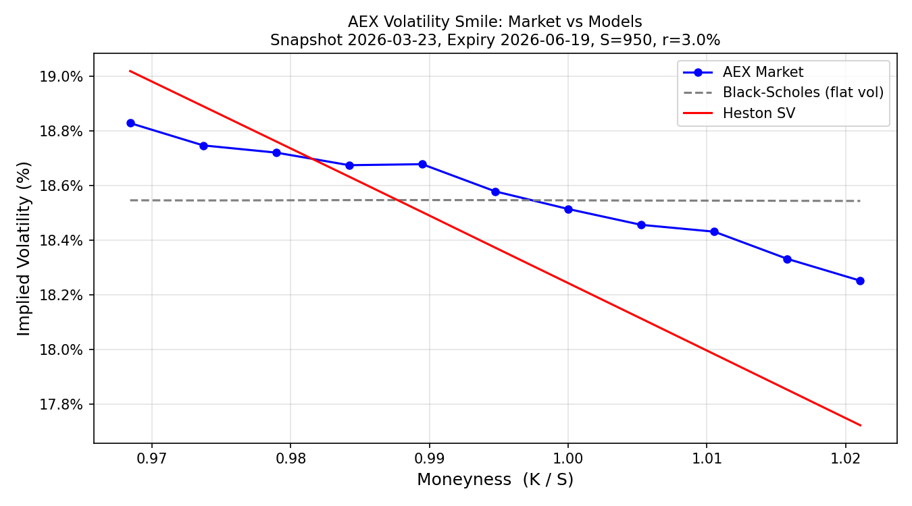
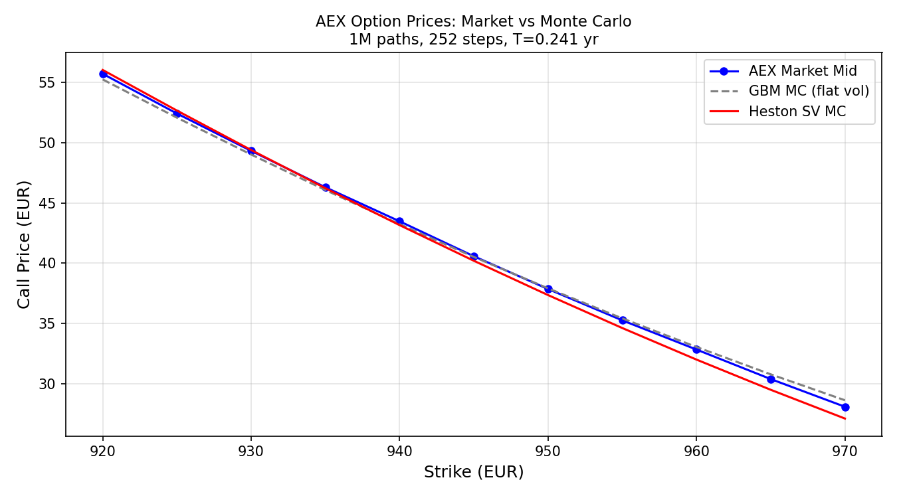

# GPU-Accelerated Monte Carlo Options Pricing Engine

> A high-performance options pricing library in C++/CUDA with Python bindings, implementing Monte Carlo simulation on the GPU for European, Asian, and barrier options under Black-Scholes and Heston stochastic volatility models.

## Performance

Benchmarked on an NVIDIA GPU (CUDA 13.2) vs a single CPU core (GCC 13.3, -O3), 252 time steps.

| Option Type | CPU 1M paths (ms) | GPU 1M paths (ms) | GPU 10M paths (ms) | Speedup (1M) |
|-------------|------------------:|------------------:|-------------------:|-------------:|
| GBM European | 4,185 | 215 | 2,154 | **19.5×** |
| GBM Asian | 7,275 | 308 | 3,086 | **23.6×** |
| GBM Barrier (Up-and-Out) | 10,136 | 954 | 9,573 | **10.6×** |
| Heston European | 11,177 | 625 | 6,271 | **17.9×** |
| Heston Asian | 10,766 | 631 | 6,339 | **17.1×** |
| Heston Barrier (Up-and-Out) | 15,531 | 1,284 | 12,925 | **12.1×** |

GPU throughput at 1M paths: **3–5 M paths/sec** for path-dependent options (Asian, Barrier),
**4–6 M paths/sec** for European options under both models.

See `benchmark_results.csv` and `python/plot_benchmarks.py` for full results and plots.

## Background

As a computational physicist specializing in GPU-accelerated plasma simulations, I build high-performance numerical solvers that run on massively parallel hardware. This project applies the same techniques — CUDA kernel design, variance reduction, memory optimization, and rigorous numerical validation — to derivative pricing in quantitative finance.

## Features

### Stochastic Models
- **Geometric Brownian Motion (GBM)**: Standard Black-Scholes dynamics. Euler-Maruyama discretization.
- **Heston Stochastic Volatility**: Coupled SDEs for price and variance with truncation scheme for negative variance. Validated against semi-analytical characteristic function solution.

### Option Types
- **European** (call/put): Closed-form validation available.
- **Asian** (arithmetic average): Path-dependent, requires full path storage on GPU.
- **Barrier** (knock-in/knock-out, up/down): Discrete monitoring with Brownian bridge correction.

### Variance Reduction
- **Antithetic variates**: Simulate paths with Z and −Z simultaneously. Near-zero cost, ~2× variance reduction.
- **Control variates**: Use known Black-Scholes price as control for variance reduction under more complex models.
- **Importance sampling** (stretch goal): Drift adjustment for deep OTM options.

### Risk Sensitivities (Greeks)
- Delta (∂V/∂S), Gamma (∂²V/∂S²), Vega (∂V/∂σ), Theta (∂V/∂t), Rho (∂V/∂r)
- Computed via finite differences with bumped simulations in a single GPU kernel launch.
- Validated against Black-Scholes closed-form Greeks.

### Python Bindings
- pybind11 interface exposing the full C++ engine to Python.
- Price options in 2–3 lines: `from mc_engine import HestonPricer; price = HestonPricer(...).price()`

## Architecture

```
CUDA_Monte_Carlo_Options_Pricing/
├── include/
│   ├── models/
│   │   ├── model.h           # Abstract base class (generate_paths_cpu, generate_paths_gpu)
│   │   ├── gbm.h             # Geometric Brownian Motion (log-Euler scheme)
│   │   └── heston.h          # Heston stochastic volatility (full truncation Euler)
│   ├── engine/
│   │   ├── cpu_engine.h      # CPU reference backend
│   │   └── gpu_engine.h      # CUDA backend (DeviceBuffer RAII, cuRAND Philox4)
│   ├── pricing/
│   │   ├── european.h        # European call/put payoff + Black-Scholes pricer
│   │   ├── asian.h           # Arithmetic Asian (running average)
│   │   └── barrier.h         # Barrier (Up/Down × In/Out, BarrierType enum)
│   └── greeks/
│       └── greeks.h          # Greeks struct + FD computation (BS analytical + MC)
├── src/
│   ├── engine/
│   │   ├── cpu_engine.cpp    # European, Asian, Barrier pricing (CPU)
│   │   └── gpu_engine.cu     # All GPU pricing methods
│   ├── greeks/
│   │   ├── greeks.cpp        # Black-Scholes Greeks + CPU finite-difference Greeks
│   │   └── greeks_gpu.cu     # GPU batched finite-difference Greeks
│   └── utils/
│       ├── black_scholes.cpp # BS call/put closed form
│       ├── heston_analytical.cpp  # Heston characteristic function pricer
│       └── implied_vol.cpp   # Brent-method implied volatility solver
├── kernels/
│   ├── gbm_kernel.{h,cu}         # GBM European (float + double template)
│   ├── gbm_antithetic_kernel.{h,cu} # Antithetic + control-variate GBM
│   ├── heston_kernel.{h,cu}      # Heston European
│   ├── asian_kernel.{h,cu}       # GBM Asian (running mean on GPU)
│   ├── asian_heston_kernel.{h,cu}# Heston Asian
│   ├── barrier_kernel.{h,cu}     # GBM Barrier (Brownian bridge correction)
│   ├── barrier_heston_kernel.{h,cu} # Heston Barrier
│   ├── greeks_kernel.{h,cu}      # 8-scenario batched kernel (CRN Greeks)
│   ├── reduction.{h,cu}          # Shared-memory parallel reduction (payoff mean + SE)
│   └── reduction_cv.{h,cu}       # Five-moment reduction for control variates
├── python/
│   ├── bindings.cpp          # pybind11 module (GBMPricer, HestonPricer, Greeks)
│   └── plot_benchmarks.py    # Benchmark plotting script (pandas + matplotlib)
├── tests/                    # Google Test suite (43 tests)
│   ├── test_european.cpp     # BS convergence, put-call parity (CPU + GPU)
│   ├── test_gpu.cpp          # GPU vs CPU statistical consistency
│   ├── test_variance_reduction.cpp  # Antithetic + control variate SE reduction
│   ├── test_heston.cpp       # Heston MC vs analytical (CPU + GPU)
│   ├── test_asian.cpp        # Asian ≤ European bound, GPU vs CPU
│   ├── test_barrier.cpp      # Knock-in + knock-out = European parity
│   └── test_greeks.cpp       # FD Greeks vs Black-Scholes analytical
├── benchmarks/
│   ├── benchmark_heston_smile.cpp  # Implied vol surface under Heston
│   └── benchmark_all_options.cpp   # CPU vs GPU timing, all option types + models
├── benchmark_results.csv     # Latest benchmark output
├── CMakeLists.txt
├── README.md
└── PLAN.md
```

The codebase has four layers:

1. **Models layer**: Stochastic process implementations (GBM, Heston). Each model implements path generation for both CPU and GPU backends via an abstract interface.
2. **Simulation engine**: CPU and CUDA backends with identical APIs. The GPU engine manages kernel launches, cuRAND state, and device memory. The CPU engine serves as reference implementation and validation baseline.
3. **Pricing layer**: Option-type-specific payoff computation and path processing. European options need only terminal values; Asian options require running averages; barrier options check boundary conditions at each step.
4. **Python bindings**: pybind11 layer exposing model configuration, pricing, and Greeks computation to Python for analysis, benchmarking, and visualization.

## Financial Background

### Why Monte Carlo?

Monte Carlo simulation is one of three standard approaches to derivative pricing (alongside PDE methods and analytical solutions). Its key advantages are: it scales naturally to high-dimensional problems (basket options, multi-asset), handles path-dependent payoffs (Asian, barrier) without special treatment, and parallelizes trivially on GPUs — each simulated path is independent.

### Black-Scholes Model

The foundational model assumes stock price follows geometric Brownian motion:

```
dS = μS dt + σS dW
```

where μ is the drift (set to risk-free rate r under risk-neutral pricing), σ is constant volatility, and dW is a Wiener process increment. This model has closed-form solutions for European options, making it ideal for validation.

### Heston Stochastic Volatility Model

Black-Scholes assumes constant volatility, which empirically produces incorrect prices for out-of-the-money options (the "volatility smile"). The Heston model addresses this by making volatility itself stochastic:

```
dS = μS dt + √v S dW₁
dv = κ(θ − v) dt + ξ√v dW₂
```

where v is the instantaneous variance, κ is mean-reversion speed, θ is long-run variance, ξ is vol-of-vol, and dW₁, dW₂ are correlated Wiener processes (correlation ρ). This model produces a realistic volatility smile and is widely used in practice.

### Greeks

Greeks measure the sensitivity of option price to changes in underlying parameters. They are essential for risk management and hedging:

- **Delta** (∂V/∂S): How much the option price changes per unit change in the underlying. Used for delta-hedging.
- **Gamma** (∂²V/∂S²): Rate of change of delta. High gamma means the hedge needs frequent rebalancing.
- **Vega** (∂V/∂σ): Sensitivity to volatility. Critical for volatility trading.
- **Theta** (∂V/∂t): Time decay. Options lose value as expiry approaches.
- **Rho** (∂V/∂r): Sensitivity to interest rates. Usually small but not negligible for long-dated options.

### Variance Reduction

Naive Monte Carlo converges at rate O(1/√N), meaning 100× more paths yields only 10× more precision. Variance reduction techniques improve this dramatically:

- **Antithetic variates**: For every path simulated with random draw Z, also simulate with −Z. Exploits the symmetry of the normal distribution to reduce variance at negligible extra cost.
- **Control variates**: Use a correlated variable with known expectation (e.g., the Black-Scholes price of a European option) to reduce the variance of the estimator for a more complex payoff.

## Build & Usage

### Prerequisites

- C++17 compatible compiler (GCC 9+ or Clang 10+)
- CUDA Toolkit 11.0+
- CMake 3.18+
- Python 3.8+ (for bindings and benchmarks)
- pybind11
- Google Test (fetched via CMake)

### Build

```bash
# Ensure CUDA toolkit is on PATH (e.g., export PATH=/usr/local/cuda/bin:$PATH)
# Activate your Python venv that has pybind11 installed

cmake -S . -B build -DCMAKE_BUILD_TYPE=Release \
      -DCMAKE_CUDA_ARCHITECTURES="75;80;86;90"
cmake --build build -j$(nproc)
```

The pybind11 Python module is discovered automatically via `python3 -c "import pybind11; ..."`.
Adjust `CMAKE_CUDA_ARCHITECTURES` to match your GPU (e.g., `89` for RTX 4000 series, `90` for H100).

### Run Tests

```bash
cd build && ctest --output-on-failure
```

All 43 tests across 7 test suites should pass.

### Python Usage

```python
import sys; sys.path.insert(0, "build")   # or install the .so to site-packages
from mc_engine import GBMPricer, HestonPricer, BarrierType

# European call + Greeks under Black-Scholes
pricer = GBMPricer(
    spot=100.0, strike=105.0, rate=0.05,
    volatility=0.2, maturity=1.0,
    n_paths=1_000_000, n_steps=252,
    use_gpu=True
)
print(pricer.price_european_call())   # PricingResult(price=..., standard_error=...)
print(pricer.compute_greeks())        # Greeks(delta=..., gamma=..., vega=..., ...)

# Barrier option
print(pricer.price_barrier_call(barrier=115.0, barrier_type=BarrierType.UP_AND_OUT))

# European call under Heston stochastic volatility
heston = HestonPricer(
    spot=100.0, strike=105.0, rate=0.05,
    v0=0.04, kappa=2.0, theta=0.04, xi=0.3, rho=-0.7,
    maturity=1.0,
    n_paths=1_000_000, n_steps=252,
    use_gpu=True
)
print(heston.price_european_call())
print(heston.price_asian_call())
```

### Benchmarks

```bash
# Run the full CPU vs GPU timing suite (all option types, 10K–10M paths)
./build/benchmark_all_options > benchmark_results.csv

# Generate publication-quality plots (requires pandas + matplotlib)
python3 python/plot_benchmarks.py benchmark_results.csv
# Produces: speedup_by_option_type.png, gpu_throughput.png, cpu_vs_gpu_timing.png
```

## Market Validation

To verify the engine against real prices, we compared against AEX index European call
options (Euronext Amsterdam, June 2026 expiry) captured on 23 March 2026.

**Setup** (all European-style — apples-to-apples with the MC engine):
- Spot: 950.00 EUR, Risk-free rate: 3.0%, T ≈ 88 days (0.241 yr)
- Strikes: 920–970 (11 strikes), call mid-prices from bid-ask
- ATM implied vol: **18.51%** (inverted from K=950 mid price)

**GBM model** prices with flat vol = ATM IV (18.51%). By construction it reprices the
ATM strike exactly and produces a flat implied vol surface across all strikes — it
cannot reproduce the market's slight downward skew.

**Heston model** is calibrated with v₀ = θ = ATM_IV² = 0.0343, κ = 2.0, ξ = 0.3,
ρ = −0.7. The negative correlation (falling prices → rising vol) produces a
downward-sloping implied vol skew that approximates the market structure.

| Strike | Mkt Price | GBM Price | Heston Price | Mkt IV | GBM IV | Heston IV |
|--------|----------:|----------:|-------------:|-------:|-------:|----------:|
| 920 | 55.73 | 55.23 | 56.06 | 18.83% | 18.53% | 19.03% |
| 930 | 49.33 | 49.00 | 49.42 | 18.72% | 18.53% | 18.77% |
| 940 | 43.48 | 43.21 | 43.18 | 18.68% | 18.53% | 18.52% |
| 950 | 37.85 | 37.88 | 37.38 | 18.51% | 18.53% | 18.26% |
| 960 | 32.83 | 33.00 | 32.03 | 18.43% | 18.53% | 18.00% |
| 970 | 28.08 | 28.58 | 27.14 | 18.25% | 18.53% | 17.75% |



*The market shows a mild downward skew (higher IV for low strikes). GBM produces a
flat line at ATM vol; Heston with ρ = −0.7 captures the skew direction.*



*GBM slightly overprices OTM calls (K > 950) and underprices ITM calls vs market;
Heston's skew corrects this in the right direction.*

Run the analysis yourself:
```bash
source ~/.venvs/dev/bin/activate
python3 scripts/market_comparison.py
```

## License

MIT
